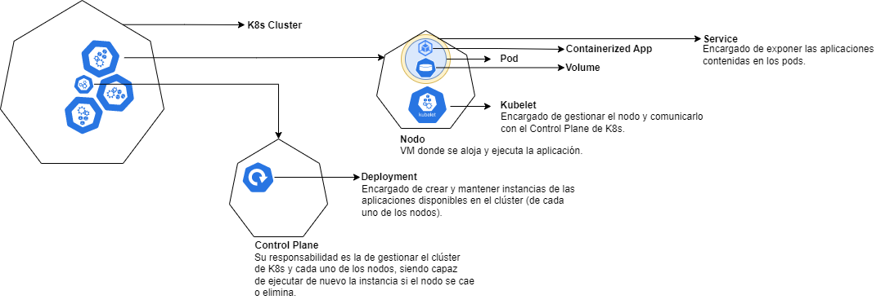

# K8s Getting started

## Kubernetes esquema



## Minikube

Cluster de Kubernetes en local, centrado para el aprendizaje y desarrollo.

1. Instalación.
    ```shell
    curl -LO https://storage.googleapis.com/minikube/releases/latest/minikube-linux-amd64
    sudo install minikube-linux-amd64 /usr/local/bin/minikube
    ```
2. Iniciar el clúster.
    ```shell
    minikube start
    ```
3. Dashboard.
    ```shell
    minikube dashboard
    ```
4. Desplegar aplicaciones.

    - **Service**
        ```shell
        # Deployment "hello-minikube" de tipo NodePort
        kubectl create deployment hello-minikube --image=kicbase/echo-server:1.0
        kubectl expose deployment hello-minikube --type=NodePort --port=8080

        # Ver el estado del servicio
        kubectl get services hello-minikube

        # Iniciar el servicio bajo un túnel, todo gestionado automáticamente por minikube
        minikube service hello-minikube

        # O bien, usar kubectl para mapear el puerto.
        kubectl port-forward service/hello-minikube 7080:8080
        ```

    - **LoadBalancer**
        ```shell
        # Deployment "balanced" de tipo LoadBalancer
        kubectl create deployment balanced --image=kicbase/echo-server:1.0
        kubectl expose deployment balanced --type=LoadBalancer --port=8080

        # Iniciar el túnel
        minikube tunnel

        # Obtener la IP external del servicio "balanced"
        kubectl get services balanced

        # Deployment disponible en <EXTERNAL-IP>:8080
        ```

    - **Ingress**
        ```shell
        # Habilitar el addon ingress
        minikube addons enable ingress

        # Aplicar el contenido del fichero `ingress-example.yml`
        kubectl apply -f ./ingress-example.yml

        # Iniciar el túnel
        minikube tunnel

        # Comprobar que funciona el ingress
        curl 127.0.0.1/foo
        curl 127.0.0.1/bar
        ```
5. Gestionar el clúster.
    ```shell
    # Pauser el clúster
    minikube pause

    # Reaunar el clúster pausado
    minikube unpause

    # Parar el clúster
    minikube stop

    # Obtener propiedades de configuración (previamente deben haber sido establecidas)
    minikube config set memory 9001
    minikube config get memory

    # Listado del catálogo de servicios de Kubernetes
    minikube addons list

    # Crear un segundo clúster con una release más antigua de K8s
    minikube start -p aged --kubernetes-version=v1.16.1

    # Eliminar todos los minikube clústers
    minikube delete --all
    ```

### Referencias

- [Controles básicos](https://minikube.sigs.k8s.io/docs/handbook/controls)
- [Configuración](https://minikube.sigs.k8s.io/docs/handbook/config)
- [Despliegue de aplicaciones](https://minikube.sigs.k8s.io/docs/handbook/deploying)
- [Kubectl](https://minikube.sigs.k8s.io/docs/handbook/kubectl)
- [Accediendo a aplicaciones](https://minikube.sigs.k8s.io/docs/handbook/accessing)
- [Headlamp](https://minikube.sigs.k8s.io/docs/handbook/addons/headlamp)
- [Ingress DNS](https://minikube.sigs.k8s.io/docs/handbook/addons/ingress-dns)
- [Subiendo imágenes](https://minikube.sigs.k8s.io/docs/handbook/pushing)

---

## Deploy

Antes de poder desplegar una aplicación, es necesario disponer de la imagen Docker de dicha aplicación.

En el directorio *ping_api* se ha dejado una pequeña aplicación para simular el proceso.

1. Construir la imagen.
    ```shell
    cd ping_api
    docker build -t {image_name:tag} .
    ```
2. Subir la imagen al registry de minikube.
    ```shell
    minikube image load {image_name:tag}
    ```
3. Crear el deployment.
    ```shell
    kubectl create deployment {deployment_name} --image={image_name:tag}
    # verificar que se ha creado correctamente el deployment
    kubectl get deployments {deployment_name}
    ```

---

## Pods y Nodos

Un **nodo** es una máquina (virtual o física, dependiendo del clúster) gestionado por el Control Plane de K8s. Dentro de cada nodo puede haber varios pods, el cual contendrá la aplicación contenerizada y (opcional) volúmenes.

Cada nodo ejecuta al menos:

- **Kubelet**, el cual se encarga de gestionar el nodo con el Control Plane de K8s; el cual gestiona los pods y los contenedores corriendo dentro de la máquina.
- **Contenedor runtime** (como Docker) responsable de:
    - Bajarse la imagen del registry.
    - Desempaquetal el contenedor.
    - Ejecutar la aplicación.

### Comandos útiles

```shell
# Obtener pods
kubectl get pods

# Mostrar información sobre un pod concreto
kubectl describe pod {pod_name}

# Visualizar los logs de un pod
kubectl logs {pod_name}
kubectl logs {pod_name} -f --tail 10

# Ejecutar un comando dentro del pod
kubectl exec {pod_name} -- {command}
kubectl exec {pod_name} -- cat /etc/os-release
kubectl exec -it {pod_name} -- bash  # inicia sesión bash dentro del pod
```

---

## Servicios

Se trata de una abstracción que define un conjunto lógico de pods y una política para acceder a ellos. Los servicios se definen en ficheros YAML o JSON.

Aunque los pods tienen sus propias IPs, dichas IPs no son expuestas fuera del clúster sin un servicio. Los servicios permiten exponer las aplicaciones contenidas en los pods con tres **tipos** diferentes:

- **ClusterIP** (por defecto): Expone el servicio en una IP interna del clúster. De esta manera el servicio será accesible únicamente dentro del clúster.

- **NodePort**: Expone el servicio en el mismo nº de puerto indicado en el pod. Hace accesible el servicio fuera del clúster con <NodeIp>:<NodePort>.

- **LoadBalancer**: Crea un load balancer y asigna una IP fija al servicio.

- **ExternalName**: Mapea el servicio al contenido del campo `externalName`, retornando un registro `CNAME` con su valor.

### Comandos útiles

```shell
# Obtener servicios
kubectl get services

# Exponer un servicio de tipo NodePort
kubectl expose {deployment_name} --type="NodePort" --port {port_number}
minikube service {service_name}

# Exponer un servicio de tipo LoadBalancer
minikube tunnel
kubectl expose {deployment_name} --type="LoadBalancer" --port {port_number}

# Ver información sobre el servicio
kubectl describe {service_name}

# Asignar un label a un pod
kubectl label pods {pod_name} key=value

# Eliminar un servicio
kubectl delete service {service_name}
kubectl delete service -l key=value  # eliminar en base al label
```

---

## Escalabilidad

Escalando un deployment nos aseguramos de que los nuevos pods son creados y agendados a nodos con recursos disponibles.

Al haber varias instancias de la aplicación repartidas en diferentes pods, debe haber una forma de gestionar la carga y distribuirla correctamente; aquí es donde entra en juego los servicio LoadBalancer, ya que internamente se encargan de redirigir el tráfico a pods disponibles.

### Comandos

```shell
# Obtener deployments
kubectl get deployments

# Obtener réplicas
kubectl get replicasets
kubectl get rs

# Escalar a x número de réplicas
kubectl scale deployment {deployment_name} --replicas {more_number_of_replicas}
# El anterior comando hará que se levantes x número de pods

# Visualizar los pods con sus respectivas IPs
kubectl get pods -o wide

# Al mostrar la info del deployment, se visualizará el escalado realizado
kubectl describe deployment {deployment_name}

# Para comprobar el correcto funcionamiento, levantar el túnel de minikube y mostrar los logs de cada uno de los pods levantados. Al hacer la petición a un endpoint de la aplicación levantada, el propio balanceador redirigirá el tráfico al pod que vea oportuno.

# Es posible escalar hacia abajo también
kubectl scale deployment {deployment_name} --replicas {less_number_of_replicas}
```

---

## Rolling Update (actualizar la versión de una App)

```shell
# Se crea una nueva versión de la imagen Docker
docker build -t {image_name}:{new_tag_versioned} .

# Se sube al registry de minikube
minikube image laod {new_image_name}

# Agregar la nueva imagen al deployment
kubectl set image deployments/{deployment_name} {deployment_name}={image_name}

# La anterior acción se encarga de levantar los nuevos pods (en función de las réplicas definidas en el escalado), una vez levantados, eliminar los anteriores, y por último actualizar el estado del ReplicaSet antiguo para indicar que no se espera ningún pod levantado por su parte. Todo ello se puede ver con
kubectl get replicasets
kubectl describe replicaset {old_replica_set}
kubectl describe {new_pod}  # en el campo Image se debe visualizar la nueva imagen
```

### Rollback

Imaginamos que se ha desplegado una imagen que contiene algún tipo de error, lo cual ocasiona que fallen los pods. Es posible volver al estado anterior funcional del deployment con el comando `kubectl rollout undo {deployment_name}`.

```
# Agregamos una imagen inexistente al desployment
kubectl set image deployments/{deployment_name} {deployment_name}={image_name}

# Al mostrar el estado de los pods se visualizará el estado ErrImagePull
kubectl get pods

# Al describir el pod fallido se mostrará más info sobre el problema ocurrido
kubectl describe pod {pod_name}

# Volver al último estado funciona conocido del deployment
kubectl rollout undo deployment {deployment_name}
```
